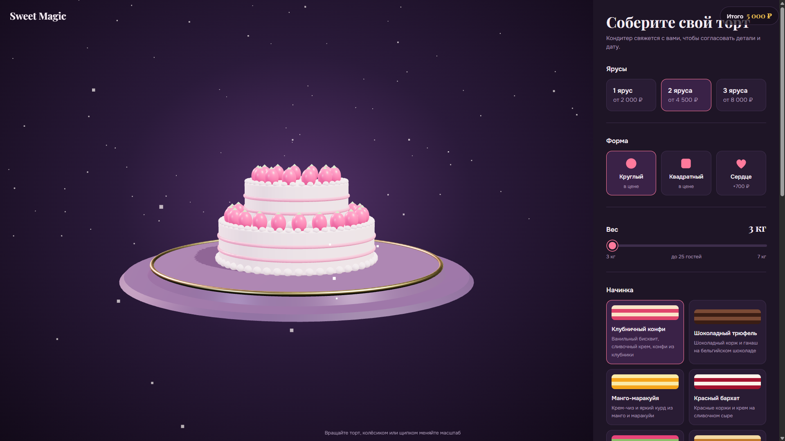
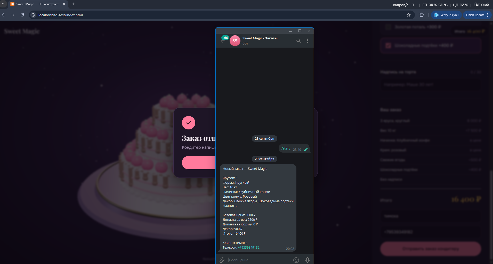

Интерактивный 3D-конструктор тортов для кондитерской "Sweet Magic"

Живой сайт: https://dartsdt.github.io/sweet_magic/

При попытке отправить "заказ кондитеру" будет ошибка, тк в данный момент токен бота в php файле отстутствует, а даже если бы он там был, то, к сожалению Pages в гитхабе не поддерживают php. Приложил скриншот снизу в качестве подтверждения работы отправки данных в бота тг.

О проекте

Интерактивный веб-конструктор, который позволяет клиентам кондитерской студии "Sweet Magic" в реальном времени собрать свой идеальный торт. Пользователь визуально выбирает параметры, видит, как меняется внешний вид торта, и сразу получает итоговую стоимость заказа.

Главная фишка: Клиент не просто заполняет форму, а буквально "собирает" торт: выбирает количество ярусов, начинку, цвет крема и пишет текст для надписи. Цена пересчитывается на лету, а готовый заказ можно отправить кондитеру одним кликом.

Возможности
- Интерактивный конструктор: 5 шагов для создания индивидуального заказа.
- Визуализация на лету: Стилизованный SVG-торт меняет цвет и количество ярусов в зависимости от выбора пользователя.
- Динамический расчёт цены: Стоимость обновляется мгновенно при каждом изменении параметров.
- Умные проверки: Система следит за соответствием веса количеству ярусов.
- Формирование заказа: Готовая спецификация для отправки в Telegram.

Технологии
- HTML5 — структура страницы.
- CSS — стилизация (яркий, современный дизайн в розово-кремово-золотой гамме, скруглённые карточки).
- JavaScript (Vanilla) — вся логика конструктора: расчёты, валидация, визуализация, формирование заказа.
- PHP — реализация отправки данных в Telegram. Сделано на PHP в целях безопасности(чтобы токен бота не был в открытом доступе) 

Скриншот подтверждающий отправку данных в бота: 

Лицензия

Этот проект создан для демонстрации портфолио. 
